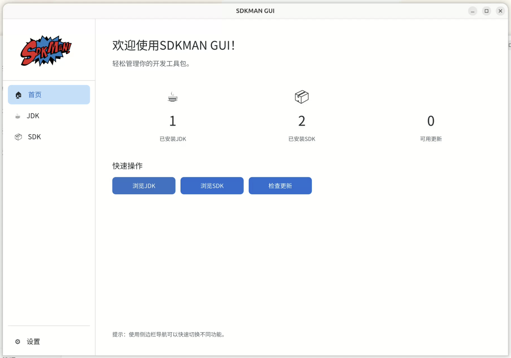
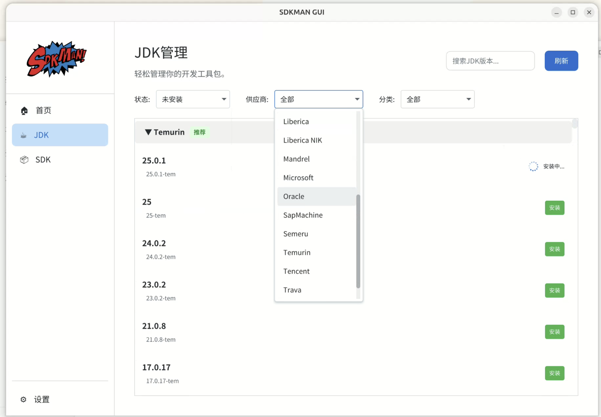
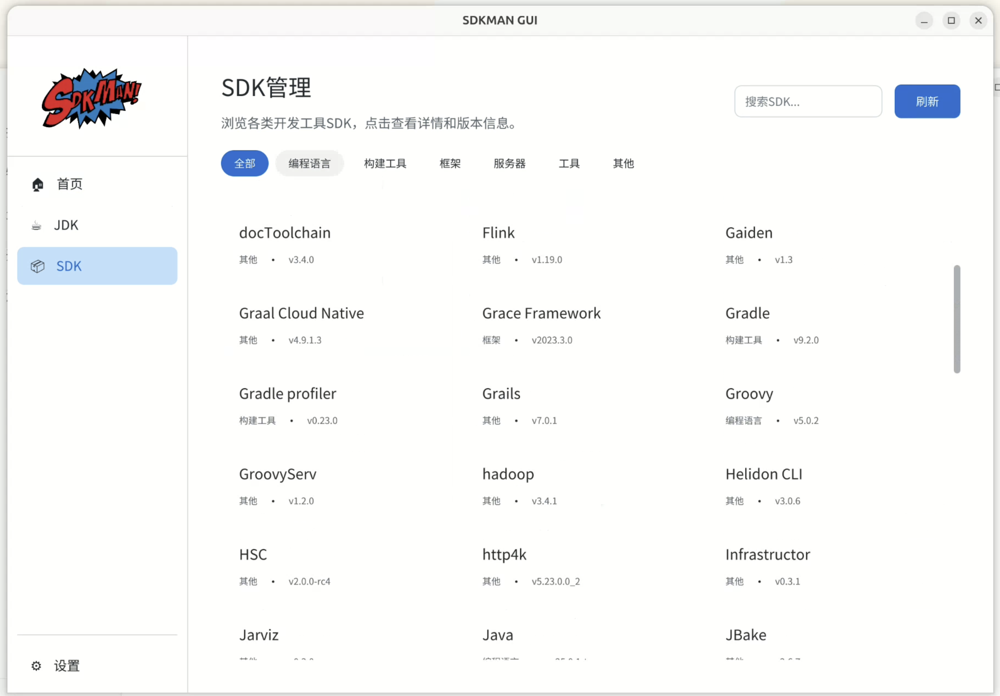
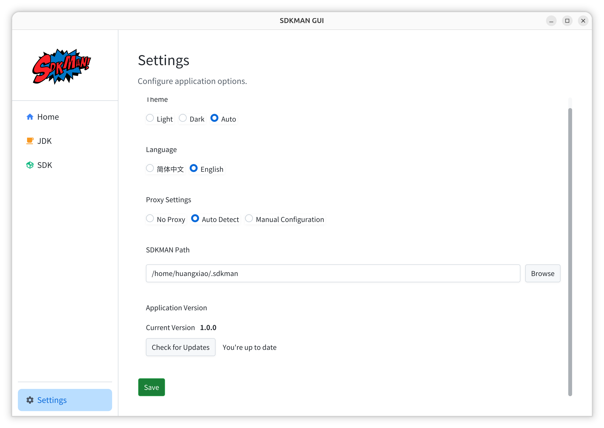

# SDKMAN GUI

**English** | [中文](README_ZH.md)

> A modern graphical management tool for [SDKMAN](https://github.com/sdkman), providing an [Applite](https://github.com/milanvarady/Applite)-like user experience.

Built with JavaFX 25 + Maven 4.0, inspired by Applite's design aesthetic, offering an elegant GUI interface for SDKMAN.

## 🎬 Demo






**[📹 Watch Demo Video (sdkman-gui.webm)](https://youtu.be/gbxEjiw3i-o)**

## ✨ Features

- 🎨 **Modern UI** - Beautiful interface design based on AtlantaFX themes
- 🌍 **Internationalization** - Support for English and Chinese with automatic system language detection
- 🌗 **Theme Switching** - Support for light/dark themes
- 📦 **SDK Management** - Browse, install, uninstall, and switch SDK versions
- 🔍 **Search & Filter** - Quickly find the SDKs you need
- 🏷️ **Category Browsing** - View SDKs by category (Java, Build Tools, Programming Languages, etc.)
- 🔄 **Update Checking** - Automatically detect SDK updates
- ⚙️ **Configuration Management** - Flexible application configuration

## 🛠️ Tech Stack

| Component | Version | Description |
|-----------|---------|-------------|
| Java | 25.0.1 | Runtime Environment |
| JavaFX | 25.0.1 | UI Framework |
| Maven | 4.0 | Build Tool |
| AtlantaFX | 2.1.0 | UI Theme Library |
| Jackson | 2.18.2 | JSON Processing |
| Log4j2    | 2.21.1 | Logging Framework |
| Apache Commons Exec | 1.5.0 | Process Execution |

## 📋 Prerequisites

- JDK 25 or higher
- Maven 4.0 or higher
- SDKMAN installed (~/.sdkman directory exists)

## 🚀 Quick Start

### Clone the Project

```bash
git clone <repository-url>
cd sdkman-gui
```

### Compile the Project

```bash
mvn clean compile
```

### Run the Application

```bash
mvn javafx:run
```

### Package into an installer

```bash
# macOS、Linux
./package.sh
```

## 🌍 Internationalization

The application supports the following languages:

- 🇺🇸 English
- 🇨🇳 Simplified Chinese

Language is automatically selected based on system settings, but can also be manually switched in the settings page.

## 🎨 Themes

Three theme modes are supported:

- **Light Theme** - Bright and refreshing
- **Dark Theme** - Eye-friendly and comfortable
- **Auto Mode** - Follows system settings

## 📝 Usage Guide

### Discovering SDKs

1. Open the application, default landing on the "Home" page
2. Browse the available SDK list
3. Use category filters or search functionality to quickly locate SDKs
4. Click "Install" button to install an SDK

### Managing Installed SDKs

1. Navigate to the "JDK" or "SDK" page
2. View all installed SDKs and versions
3. You can:
   - Set default versions
   - Install new versions
   - Uninstall unwanted versions
   - Switch between versions

### SDK Details Management

1. Click on any SDK to view detailed information
2. Browse all available versions
3. Manage individual versions:
   - Install specific versions
   - Uninstall versions
   - Set versions as default
   - View installation status and progress

### Configuring the Application

1. Navigate to the "Settings" page
2. You can configure:
   - Interface theme
   - Display language
   - SDKMAN installation path

## 🔧 Configuration File

Application configuration is saved in: `~/.sdkman-gui/config.json`

Configuration example:

```json
{
  "language": "en_US",
  "theme": "light",
  "autoUpdate": true,
  "sdkmanPath": "/Users/username/.sdkman"
}
```

## 🐛 Troubleshooting

### Unable to Start Application

Ensure JDK 25 is installed:
```bash
java -version
```

### Unable to Find SDKMAN

Check if SDKMAN is installed:
```bash
ls ~/.sdkman
```

If not installed, please visit: https://sdkman.io/install

### Maven Build Failure

Ensure you're using Maven 4.0:
```bash
mvn -version
```

### Installation Issues

If you encounter installation failures:
1. Check the application logs for detailed error messages
2. Ensure your internet connection is stable
3. Verify SDKMAN CLI is working correctly:
   ```bash
   source ~/.sdkman/bin/sdkman-init.sh
   sdk list
   ```

## 📚 Documentation

- [JavaFX 25 Documentation](https://openjfx.io/javadoc/25/)
- [AtlantaFX Documentation](https://mkpaz.github.io/atlantafx/)
- [SDKMAN Documentation](https://sdkman.io/usage/)

## 📄 License

MIT License

## 🙏 Acknowledgments

- [SDKMAN](https://sdkman.io/) - Excellent SDK management tool
- [AtlantaFX](https://github.com/mkpaz/atlantafx) - Beautiful JavaFX theme library
- [Applite](https://github.com/milanvarady/Applite) - UI design inspiration source
