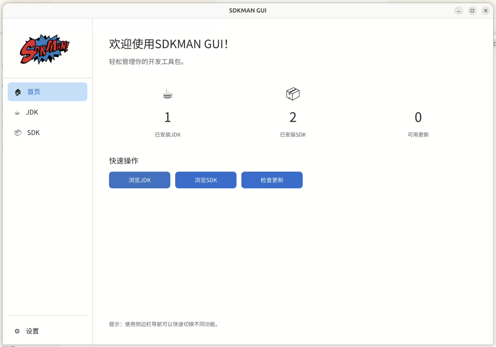
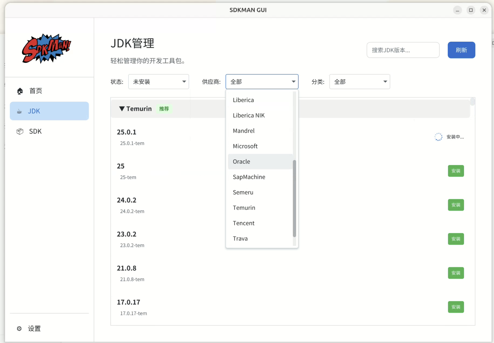
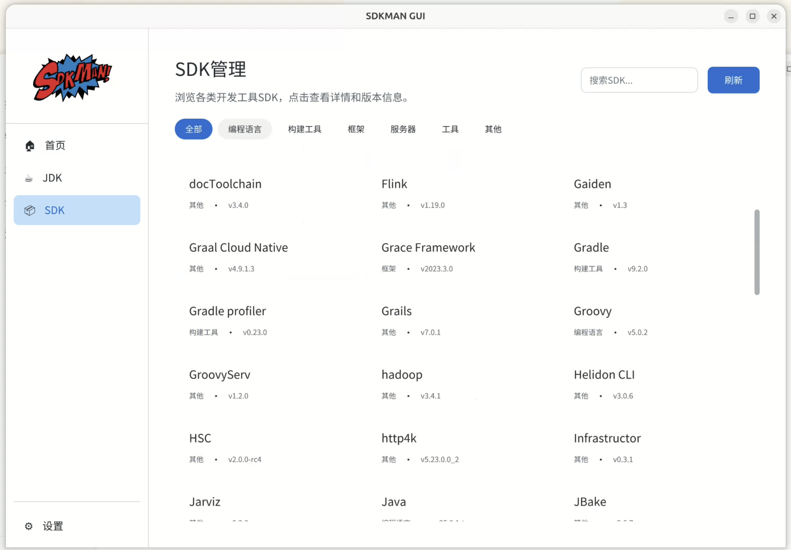
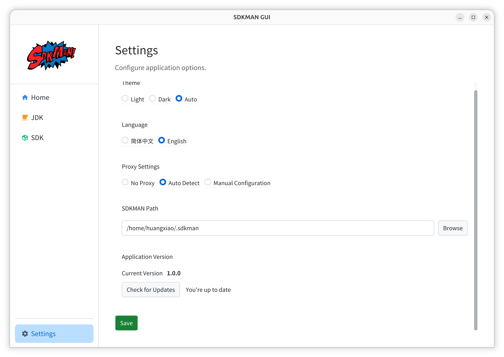

# SDKMAN GUI

原生版本请看：[sdkman-gui-native](https://github.com/youngledo/sdkman-gui-native)。

[English](README.md) | **中文**

> 现代化的[SDKMAN](https://github.com/sdkman)图形化管理工具。

跨平台，支持Windows、macOS、Ubuntu。基于JavaFX + Maven开发，为SDKMAN提供优雅的GUI界面。

## 🎬 演示






**[📹 观看此视频 (sdkman-gui.webm)](https://youtu.be/gbxEjiw3i-o)**

## ✨ 特性

- 💻 **跨平台** - 支持Windows、macOS、Ubuntu
- 🎨 **现代化UI** - 基于AtlantaFX主题，提供精美的界面设计
- 🌍 **国际化支持** - 支持中英文，自动检测系统语言
- 🌗 **主题切换** - 支持亮色/暗色主题
- 📦 **SDK管理** - 浏览、安装、卸载、切换SDK版本
- 🔍 **搜索过滤** - 快速查找所需的SDK
- 🏷️ **分类浏览** - 按类别查看SDK（Java、构建工具、编程语言等）
- 🔄 **更新检查** - 自动检测SDK更新
- ⚙️ **配置管理** - 灵活的应用配置

## 📦 安装

### macOS

**手动安装：**
从 [Releases](https://github.com/youngledo/sdkman-gui/releases) 下载对应架构的 DMG 文件：
- Apple Silicon：`sdkman-gui_*_arm64.dmg`

**Homebrew：**
```bash
brew tap youngledo/sdkman-gui
brew install --cask sdkman-gui
```

### Windows

从 [Releases](https://github.com/youngledo/sdkman-gui/releases) 下载并运行安装程序：
- `sdkman-gui_*_x86_64.exe`

### Linux

**Debian/Ubuntu：**
```bash
# 从 releases 下载 .deb 包
wget https://github.com/youngledo/sdkman-gui/releases/download/v1.0.0/sdkman-gui_1.0.0_x86_64.deb
sudo dpkg -i sdkman-gui_1.0.0_x86_64.deb
```

**Fedora/RHEL：**
```bash
# 从 releases 下载 .rpm 包
wget https://github.com/youngledo/sdkman-gui/releases/download/v1.0.0/sdkman-gui_1.0.0_x86_64.rpm
sudo rpm -i sdkman-gui_1.0.0_x86_64.rpm
```

### 前置要求

⚠️ **必须先安装 SDKMAN：**
```bash
curl -s "https://get.sdkman.io" | bash
```

## 🌍 国际化

应用支持以下语言：

- 🇺🇸 English（英文）
- 🇨🇳 简体中文

语言会根据系统设置自动选择，也可以在设置页面手动切换。

## 🎨 主题

支持三种主题模式：

- **亮色主题**（Light）- 明亮清爽
- **暗色主题**（Dark）- 护眼舒适
- **自动模式**（Auto）- 跟随系统设置

## 📝 使用说明

### 发现SDK

1. 打开应用后，默认进入"发现"页面
2. 浏览可用的SDK列表
3. 使用分类筛选或搜索功能快速定位
4. 点击"安装"按钮即可安装SDK

### 管理已安装的SDK

1. 切换到"已安装"标签页
2. 查看所有已安装的SDK
3. 可以：
   - 设置默认版本
   - 更新到最新版本
   - 卸载不需要的版本

### 配置应用

1. 切换到"设置"标签页
2. 可配置：
   - 界面主题
   - 显示语言
   - 自动更新检查
   - SDKMAN路径

## 🔧 配置文件

应用配置保存在：`~/.sdkman-gui/config.json`

配置示例：

```json
{
  "language": "zh_CN",
  "theme": "light",
  "autoUpdate": true,
  "sdkmanPath": "/Users/username/.sdkman"
}
```

## 📄 许可证

MIT License

## 🙏 致谢

- [SDKMAN](https://sdkman.io/) - 优秀的SDK管理工具
- [AtlantaFX](https://github.com/mkpaz/atlantafx) - 精美的JavaFX主题库
- [IKonli](https://github.com/kordamp/ikonli) - 精美的JavaFX图标库
